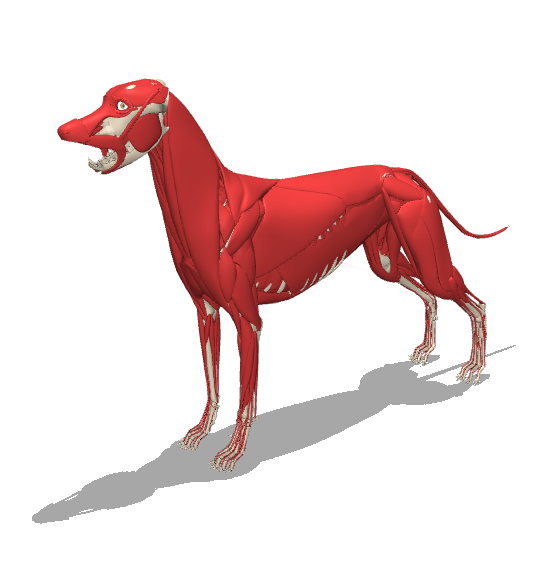
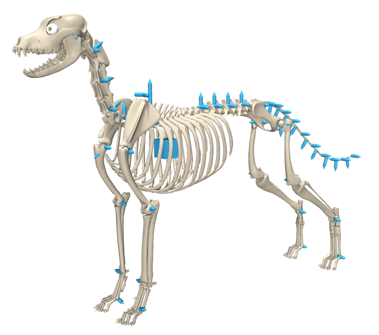
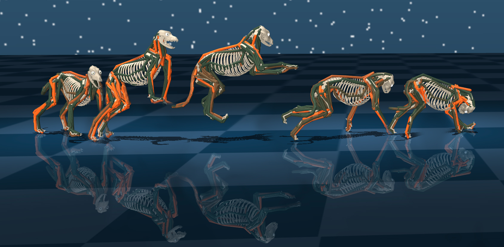

# Musculoskeletal Dog
<p float="left">
  
   
  
  
</p>

This repository contains 3 MuJoCo models of a dog:
1. Entirely torque based.
2. Musculoskeletal model using Millard's dynamics
3. Musculoskeletal model using a sigmoid function for activation/deactivation dynamics.

The muscle model:

<p float="left">
  
</p>

Example of the dog used in simulation:

<p float="left">
  
</p>

## Contents

Following the [MuJoCo Menagerie](https://github.com/google-deepmind/mujoco_menagerie) convention, each
dog model is standalone (no floor, no lights, no skybox) so it can be dropped into your own scene, and
is paired with a `scene*.xml` that adds the ground plane and lighting for stand-alone viewing.

| Model | Scene | Description |
| --- | --- | --- |
| [`dog.xml`](musculoskeletal_dog/models/dog.xml) | [`scene.xml`](musculoskeletal_dog/models/scene.xml) | Torque-actuated (38 actuators) |
| [`dog_muscles_Millard.xml`](musculoskeletal_dog/models/dog_muscles_Millard.xml) | [`scene_muscles_Millard.xml`](musculoskeletal_dog/models/scene_muscles_Millard.xml) | Muscle-actuated (127 muscles), Millard dynamics |
| [`dog_muscles_Sigmoid.xml`](musculoskeletal_dog/models/dog_muscles_Sigmoid.xml) | [`scene_muscles_Sigmoid.xml`](musculoskeletal_dog/models/scene_muscles_Sigmoid.xml) | Muscle-actuated (127 muscles), sigmoid activation dynamics |

```
musculoskeletal_dog/
├── models/          # the three dog models and their scenes
└── assets/
    ├── meshes/      # bone meshes (STL)
    ├── skins/       # muscle skins (SKN)
    └── textures/
```

## Loading the model

### Viewer

The quickest way to look at the model is the interactive viewer that ships with the MuJoCo Python
package:

```bash
pip install mujoco
python -m mujoco.viewer --mjcf=musculoskeletal_dog/models/scene.xml
```

Alternatively, download the MuJoCo release from the
[releases page](https://github.com/google-deepmind/mujoco/releases) and drag any of the `scene*.xml`
files onto the `simulate` binary (see
[Getting Started](https://mujoco.readthedocs.io/en/latest/programming/#getting-started)).

### Python

```python
import mujoco

model = mujoco.MjModel.from_xml_path("musculoskeletal_dog/models/scene.xml")
data = mujoco.MjData(model)

while data.time < 1.0:
    mujoco.mj_step(model, data)
```

### Using the dog in your own scene

Include the bare model and provide your own floor, lights and skybox:

```xml
<mujoco model="my scene">
  <include file="path/to/musculoskeletal_dog/models/dog.xml"/>

  <worldbody>
    <light pos="0 0 3" dir="0 0 -1" directional="true"/>
    <geom name="floor" type="plane" size="10 10 0.1"/>
  </worldbody>
</mujoco>
```

The models reference their meshes, skins and textures by paths relative to the model file itself
rather than through `meshdir`/`texturedir`. MuJoCo drops an included file's `meshdir` but resolves its
relative asset paths against that file's own directory, so the include above works from any location —
including one where your own model declares a different `meshdir`. Just keep `models/` and `assets/`
in their relative positions.

## License

Released under the [MIT License](LICENSE).

## Citation

If you use this model in your research, please cite:

> V. La Barbera, S. Bohez, L. Hasenclever, Y. Tassa, and J. R. Hutchinson,
> "Motion Tracking with Muscles: Predictive Control of a Parametric Musculoskeletal Canine Model,"
> arXiv:2506.23768, 2025. https://arxiv.org/abs/2506.23768

```bibtex
@article{labarbera2025motion,
  title   = {Motion Tracking with Muscles: Predictive Control of a Parametric
             Musculoskeletal Canine Model},
  author  = {La Barbera, Vittorio and Bohez, Steven and Hasenclever, Leonard and
             Tassa, Yuval and Hutchinson, John R.},
  journal = {arXiv preprint arXiv:2506.23768},
  year    = {2025},
  url     = {https://arxiv.org/abs/2506.23768}
}
```
